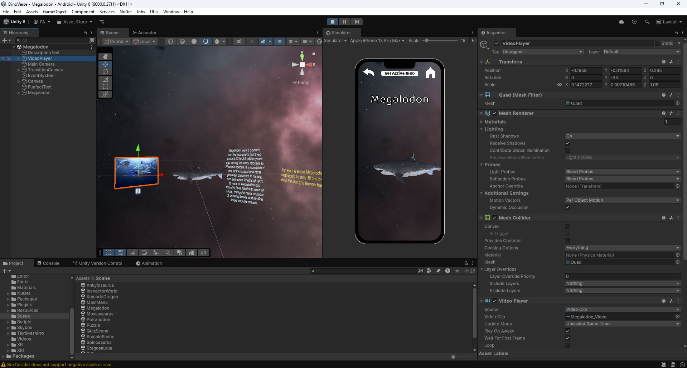
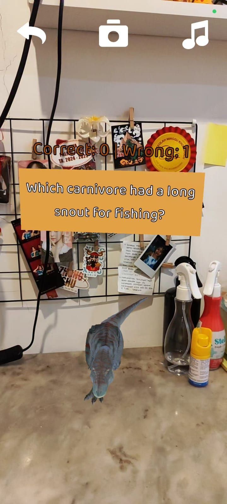
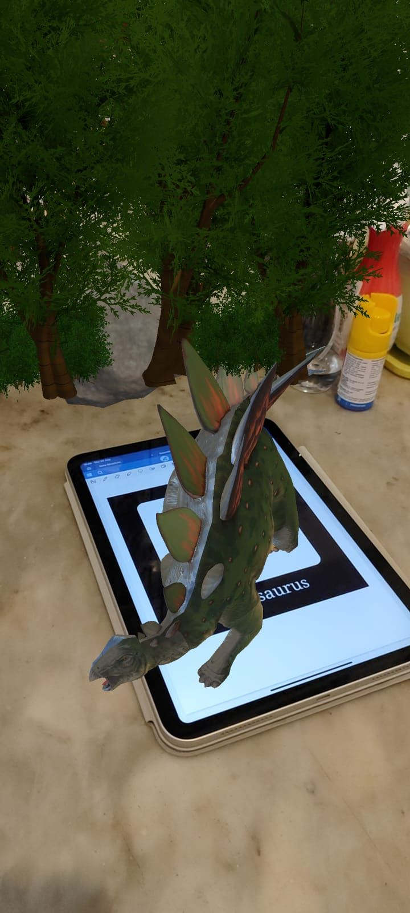

# 🦖 DinoVerse

DinoVerse is an interactive experience focused on immersive environments and user-centered interaction, combining design, interactivity, and real-time systems.

---

## 📸 Preview

  
  

  
  

---

## 🚀 Overview

DinoVerse explores how interactive systems and immersive design can be combined to create engaging digital experiences.

The project emphasizes user interaction, visual clarity, and responsive system behavior, delivering a seamless and intuitive experience.

---

## 🎮 Features

- Interactive user-centered experience  
- Immersive dinosaur-themed environment  
- AR/visual exploration components  
- Real-time interaction and navigation  
- Clean and intuitive UI/UX  

---

## 🧠 Focus

- Human-Computer Interaction (HCI)  
- Interactive system design  
- Immersive experience development  

---

## 🛠️ Tech Stack

Unity • C# • AR components  

---

## ⚡ Notes

DinoVerse highlights the integration of interaction design and real-time systems to create engaging and immersive digital experiences.
